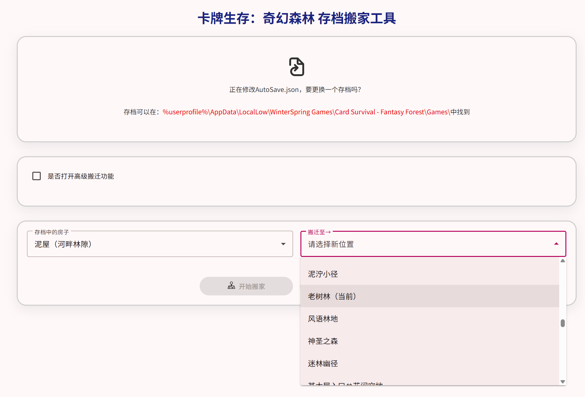

# 卡牌生存：奇幻森林 存档搬家工具

[](https://github.com/Shosetsu/CSFFHouseMover/blob/master/README.md)
[](https://github.com/Shosetsu/CSFFHouseMover/blob/master/README_en.md)

> 一个用于《卡牌生存：奇幻森林》（Card Survival: Fantasy Forest）游戏的存档编辑小工具，帮助你轻松将建筑、设施等卡片从一个地点“搬”到另一个地点。



## 📌 功能介绍

- **可视化操作**：上传存档后，可直观选择要移动的卡片（如木屋、地窖、菜园、雨水窖等）。
- **精准定位**：支持在不同环境（位置）之间转移卡片。
- **智能识别**：自动识别房屋类与非房屋类卡片，提供合适的操作选项。
- **安全导出**：修改完成后一键下载新存档，原文件不受影响。
- **无需安装**：纯前端网页工具，所有数据处理均在浏览器中完成，保护你的隐私和存档安全。

## 🛠️ 使用方法

1. 打开 [在线工具网站](https://shosetsu.github.io/CSFFHouseMover/)
2. 点击 **“选择存档文件”**，上传你的 `AutoSave.json` 文件（可以在`%userprofile%\AppData\LocalLow\WinterSpring Games\Card Survival - Fantasy Forest\Games\`中找到）
3. 工具会自动解析当前角色所在位置及可用的卡片
4. - 如果你想移动**房屋**（木屋、地窖、泥屋、畜栏），请取消勾选 “是否打开高级搬迁功能”
   - 如果你想移动**设施**（菜园、雨水窖、鞣制坑等），请勾选 “是否打开高级搬迁功能”，并选择具体过滤关键字
5. 在下拉菜单中选择你要移动的**目标卡片**和**目标位置**
6. 点击 **“开始搬家”**（房屋）或 **“开始搬 [种类]”**（设施）
7. 点击 **“保存存档”** 下载修改后的 JSON 文件
8. 将新文件放回游戏存档目录，覆盖原文件（建议先备份！）

> ⚠️ **重要提示**：操作前务必备份原始存档！虽然工具经过测试，但游戏版本更新可能导致兼容性问题。

## ❓ 常见问题

### Q：为什么我找不到我的木屋？

A：请确保你没有勾选“是否打开高级搬迁功能”选项。房屋类卡片只在该选项关闭时显示。

### Q：移动后游戏崩溃了怎么办？

A：立即用备份的存档恢复。可能是目标位置不合法，或游戏版本与工具支持的结构不一致。

### Q：支持哪些卡片？

A：目前内置支持：

- 房屋：木屋、地窖、泥屋、畜栏
- 设施：菜园（`GardenPlot`）、雨水窖（`RainCistern`）、鞣制坑（`TanningPit`）、各种陷阱（`Trap`）、各种大田（`Field`）
  其他卡片也可直接在输入框中手动输入。

## 💻 本地开发

本项目基于 Angular 构建，如需本地运行：

```bash
git clone https://github.com/shosetsu/CSFFHouseMover.git
cd CSFFHouseMover
npm install
npm run start
```
