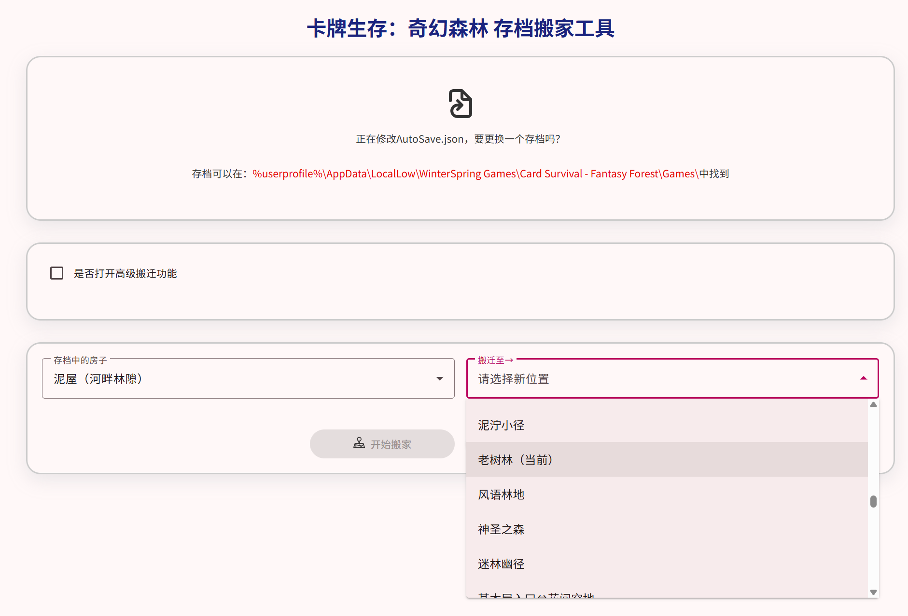

# Card Survival: Fantasy Forest Savegame Mover

[](README.md)
[](README_en.md)

> A handy save editor for the game _Card Survival: Fantasy Forest_, allowing you to easily "move" buildings, facilities, and other cards from one location to another.



📌 **Features**

- **Visual Interface**: After uploading your save file, intuitively select cards to move (e.g., cabin, cellar, garden plot, rain cistern, etc.).
- **Precise Relocation**: Transfer cards between different environments (locations).
- **Smart Recognition**: Automatically distinguishes between house-type and non-house-type cards, offering appropriate operation options.
- **Safe Export**: One-click download of the modified save file—your original file remains untouched.
- **No Installation Required**: Pure frontend web tool. All data processing happens locally in your browser, ensuring privacy and save file security.

🛠️ **How to Use**

1. Open the [online tool](https://shosetsu.github.io/CSFFHouseMover/)
2. Click **“Choose Save File”** and upload your `AutoSave.json` (typically found in `%userprofile%\AppData\LocalLow\WinterSpring Games\Card Survival - Fantasy Forest\Games\`)
3. The tool will automatically parse your character’s current location and available cards
4. - To move **houses** (cabin, cellar, mud hut, enclosure), **uncheck** “Non-House Mode”
   - To move **facilities** (garden plot, rain cistern, tanning pit, traps, fields, etc.), **check** “Non-House Mode” and optionally select a specific filter keyword
5. From the dropdown menus, choose your **target card** and **destination location**
6. Click **“Start Moving”** (for houses) or **“Start Moving [Type]”** (for facilities)
7. Click **“Save Archive”** to download the modified JSON file
8. Place the new file back into your game save directory, overwriting the original (always back up first!)

⚠️ **Important Note**: Always back up your original save file before making changes! Although the tool has been tested, game updates may introduce compatibility issues.

❓ **FAQ**

**Q: Why can’t I find my cabin?**  
A: Make sure “Non-House Mode” is unchecked. House-type cards only appear when this option is disabled.

**Q: The game crashes after moving cards—what should I do?**  
A: Immediately restore your backup save. This may happen if the destination location is invalid or if the game version differs from what the tool supports.

**Q: Which cards are supported?**  
A: Currently built-in support includes:

- **Houses**: Cabin, Cellar, Mud Hut, Enclosure
- **Facilities**: Garden Plot (`GardenPlot`), Rain Cistern (`RainCistern`), Tanning Pit (`TanningPit`), various Traps (`Trap`), and Fields (`Field`)  
  Other cards can also be moved by manually entering their identifiers.

💻 **Local Development**

This project is built with Angular. To run it locally:

```bash
git clone https://github.com/shosetsu/CSFFHouseMover.git
cd CSFFHouseMover
npm install
npm run start
```
